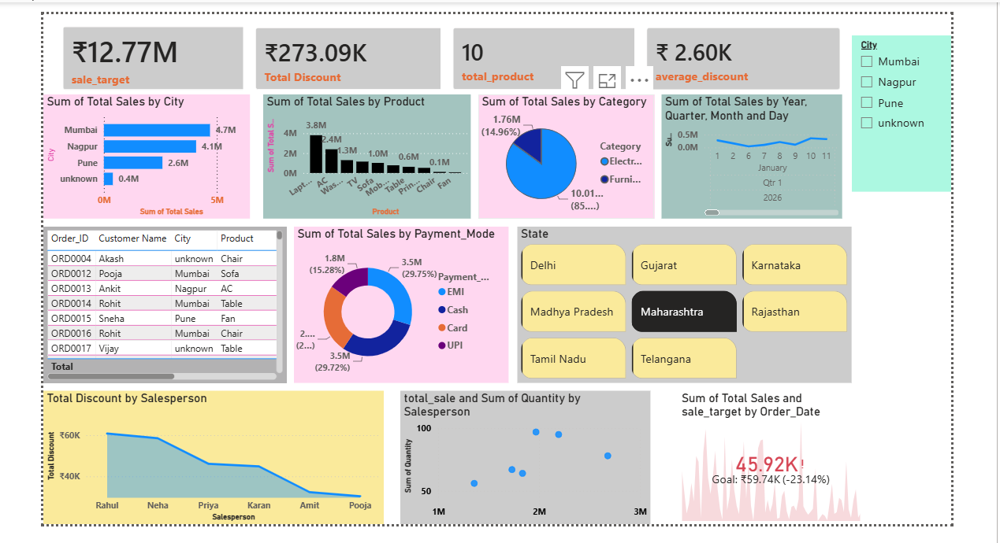

# HR Analytics Dashboard

## 📌 Project Overview
This HR Analytics Dashboard is built using Power BI to analyze employee attrition, workforce trends, and key HR metrics through interactive visualizations.

## 🎯 Objectives
- Analyze employee attrition.
- Identify workforce trends.
- Monitor HR KPIs.
- Support data-driven HR decisions.

## 🛠️ Tools & Technologies
- Power BI
- Microsoft Excel
- DAX
- Power Query

## ✨ Features
- Employee Attrition Analysis
- Department-wise Analysis
- Gender-wise Analysis
- Age Group Analysis
- Job Role Analysis
- Interactive Dashboard
- KPI Cards

## 📂 Files Included
- HR_Analytics_Dashboard.pbix
- HR_Dashboard_Dataset.xlsx (Optional)

## 📊 Dashboard Preview

## 👤 Author

**Rahul Mane**

GitHub: https://github.com/rahulmane0256
